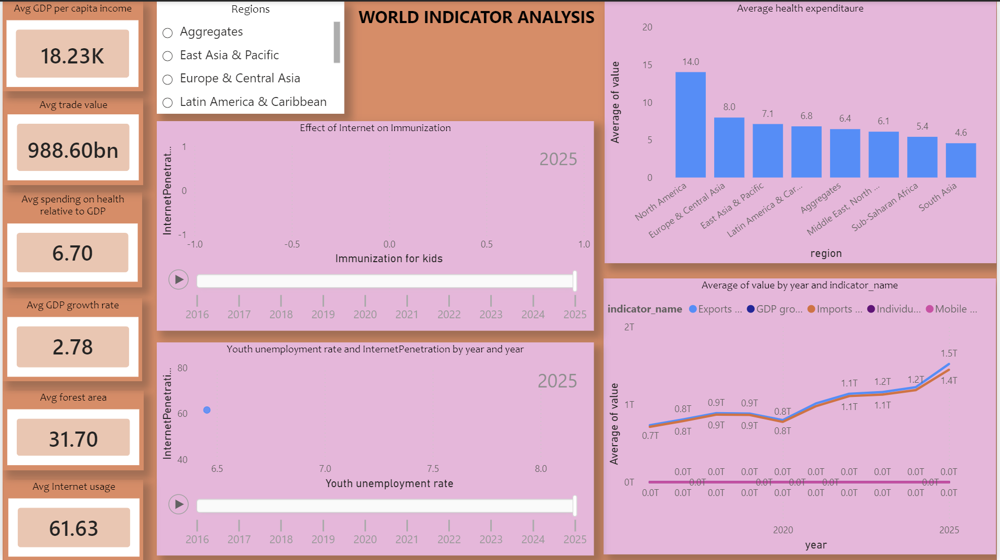

# GlobalPluse

## Key Findings

- **5 headline KPI metrics** summarize the dashboard across economic, health, environmental, trade, and technology dimensions: GDP per capita, GDP growth, trade value, health expenditure, forest area, and internet usage. The KPI cards are configured as **averages**, making them useful for comparing typical country/region performance rather than totals.

- **Regional differences are a central driver of the analysis.** A **single-select Regions slicer** is connected to the dashboard, allowing the same KPIs and charts to be examined by geographic region. This makes it possible to compare how economic, health, environmental, and digital indicators vary across regions.

- **Economic performance is represented by 2 complementary measures:** GDP per capita and GDP growth. Looking at both helps distinguish between countries/regions with high income levels and those experiencing stronger current growth.

- **Health spending is explicitly compared across regions.** The dashboard uses **Current health expenditure (% of GDP)** and displays it as an average by region, helping identify differences in the share of economic output devoted to health.

- **Internet access is used as a cross-domain indicator.** The dashboard directly tests its relationship with **2 social outcomes**: childhood immunization and youth unemployment. This moves the analysis beyond simple KPI reporting into relationship analysis.

- **The immunization analysis uses a time-aware scatter plot**, with **year** used both as the category and as the play-axis. This supports observing how the relationship between internet penetration and immunization changes over time rather than relying on a single static snapshot.

- **Youth employment is assessed through the same internet-penetration lens.** The second scatter plot compares **youth unemployment rate** with internet usage, providing a way to identify whether higher digital penetration coincides with different youth-labour-market outcomes across countries and years.

- **Health performance is ranked across regions.** The regional health chart sorts average health expenditure in descending order, making the highest- and lowest-spending regions immediately visible.

- **The dashboard spans at least 8 named indicators**: forest area, GDP growth, GDP per capita, health expenditure, trade value, internet usage, childhood immunization, and youth unemployment. This provides a multi-dimensional view of development rather than focusing on a single economic measure.

##Dashboard

## Additional Insights Visible from the Dashboard Design

- The dashboard combines **5 KPI cards + 2 scatter plots + 1 regional comparison chart + 1 multi-year trend chart + 1 regional slicer**, creating **10 major analytical elements** on a single page.

- The analysis intentionally links **economic development, public health, environment, trade, digital adoption, and labour markets**, allowing users to look for cross-domain patterns rather than evaluating indicators independently.

- The multi-year trend visual is designed to compare indicator trajectories over time and uses **average values** for the plotted indicator series. This makes it appropriate for identifying broad regional/global direction and changes in indicator levels.

- The dashboard is particularly useful for identifying **correlation-style patterns**, but the visual relationships should not be interpreted as causal effects. For example, higher internet penetration may coincide with higher immunization or different youth unemployment levels without proving that internet access caused those outcomes.

## Metrics Covered

| Area | Metric |
|---|---|
| Economy | GDP per capita (current US$) |
| Economy | GDP growth (annual %) |
| Trade | Average trade value |
| Health | Current health expenditure (% of GDP) |
| Environment | Forest area (% of land area) |
| Technology | Individuals using the Internet (% of population) |
| Health / Social | Immunization for kids |
| Labour | Youth unemployment rate |
"""
